#无线七期-孙天天的作业
-------------------

##1.给出ios开发者设置中的网络模拟的详细数据
手机连接mac电脑，并使用XCode激活设备，此时在iphone手机-设置 中出现“开发者”选项，如下图
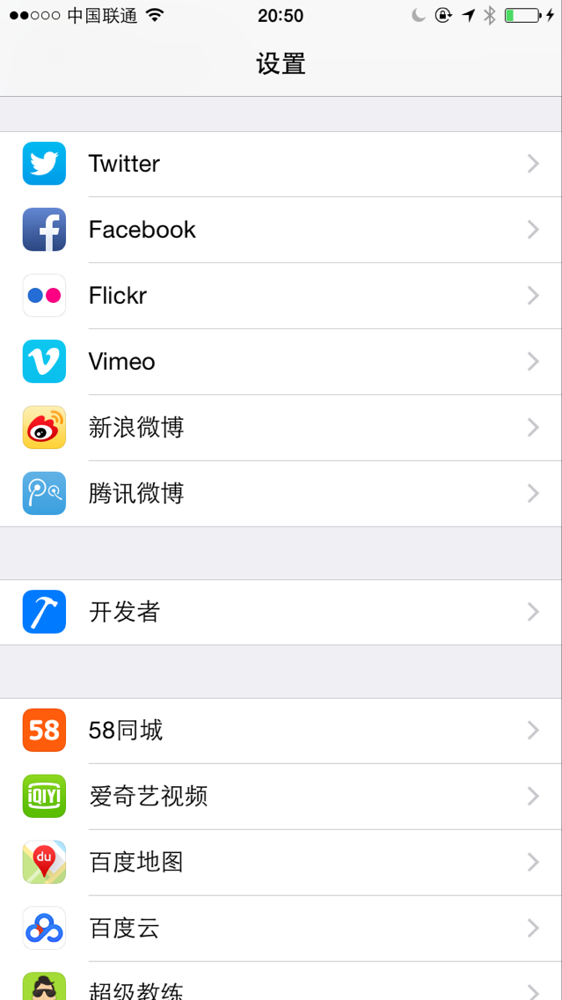 

注意中间的**NETWORK LINK CONDITIONER**
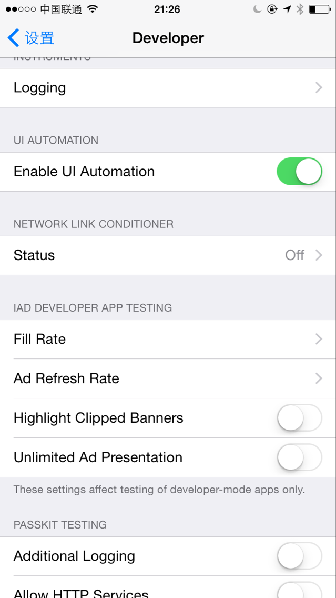

上图中的**Status**是表示网络限制是否开启，点击进去就可看到详细设置
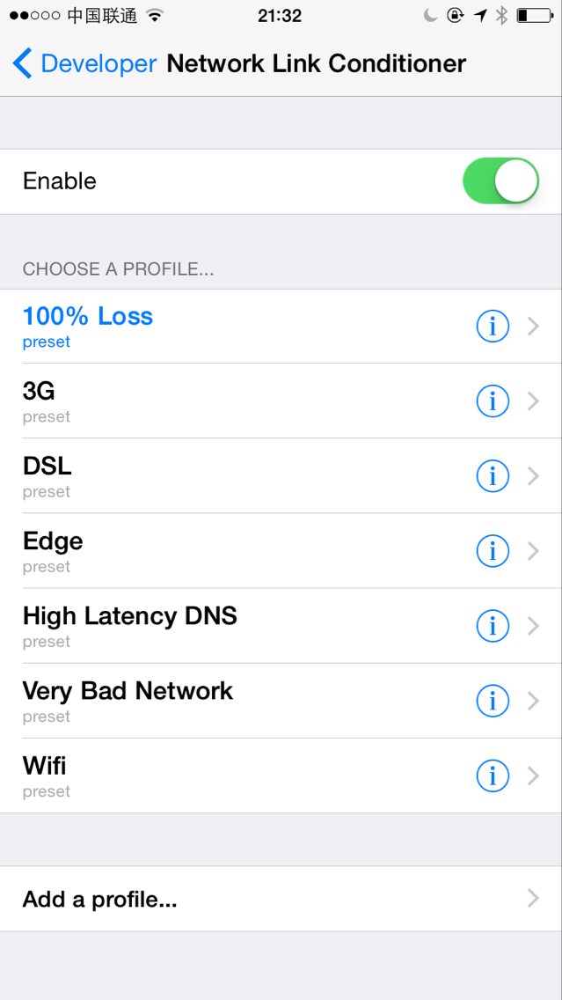

可以看到系统默认配置的网络条件还是很多的，其中：
100%Loss是全丢包,
3G这个大家应该都知道,
DSL是电话线上网,
Edge是2G网络，
High Latency DNS是高延迟，
Very Bad Network是网络状况不稳定。
并且底部还有一个添加额外配置的选项可以自定义网络状况。

PS：Status开启后影响的是整个系统，所以调试完毕后不要忘记关掉，免得奇怪网络状态咋不正常了。。。
##2.使用任意的抓包工具对任意的app进行抓包，并给出抓包的截图
工具名称：Charles
下载地址：http://www.charlesproxy.com
网上有很多教程：http://blog.csdn.net/lmmilove/article/details/50244537
本人实际操作：
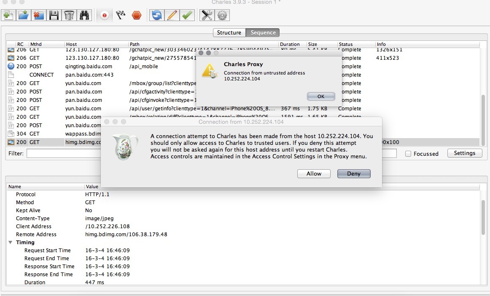
PC安装SSL证书，同时手机也安装SSL证书，抓起iphone网络封包，如下
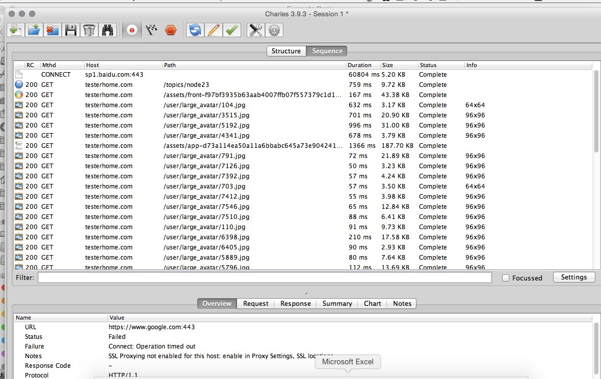
PC安装SSL证书，在一个手机没有安装SSL证书，在iphone上抓取相同网络链接的iphone网络封包。证实手机如果不安装ssl证书，https请求抓不全，如下
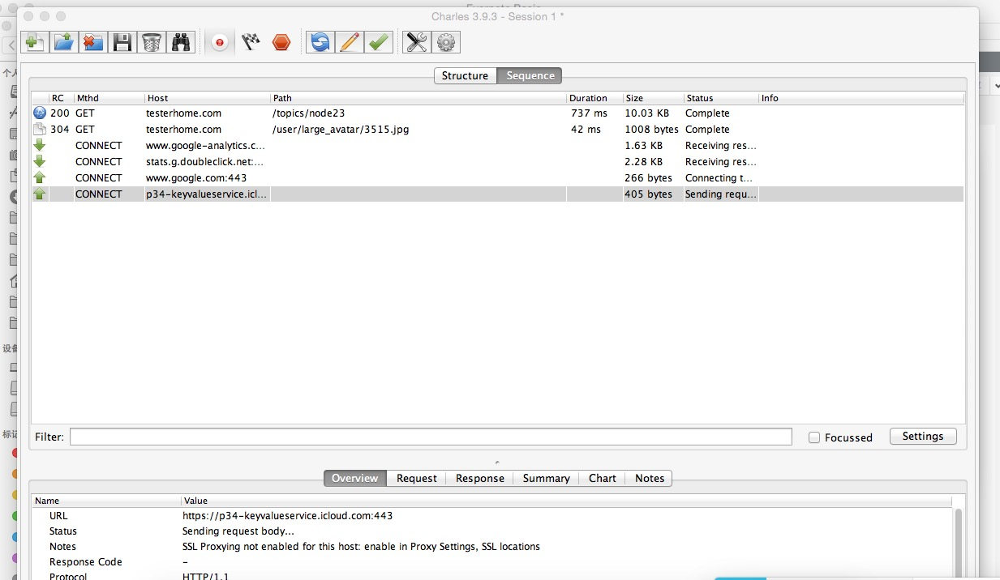

##3.获取proxy tool的默认ssl证书，并且在iphone上进行安装，给出安装截图
如果要截取分析SSL协议相关的内容。那么需要安装Charles的CA证书。具体步骤如下：
去 http://www.charlesproxy.com/documentation/additional/legacy-ssl-proxying/ 下载CA证书文件。
本人实践环节截图：
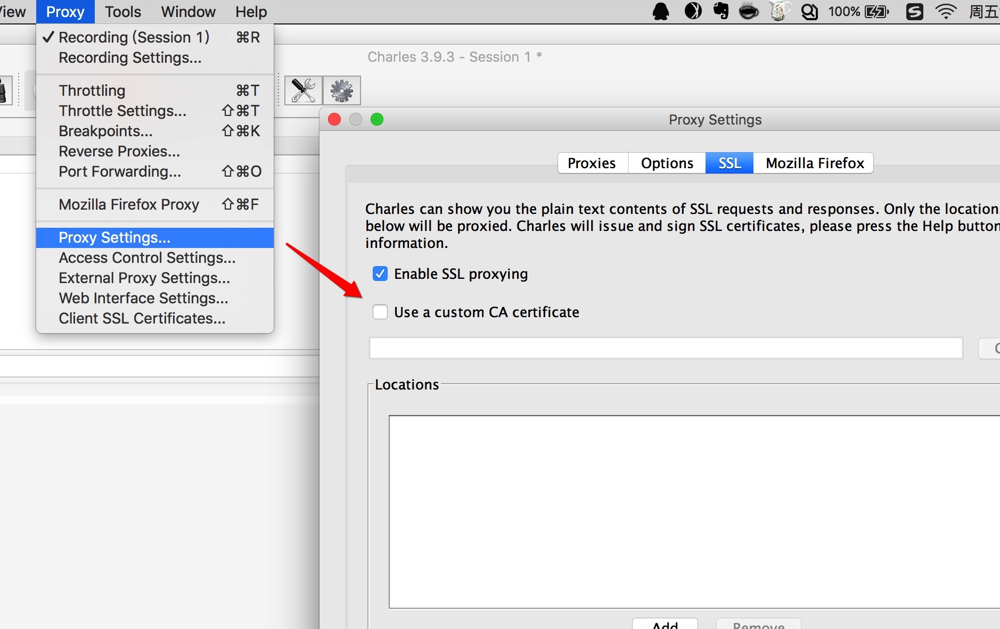
手机端截图：
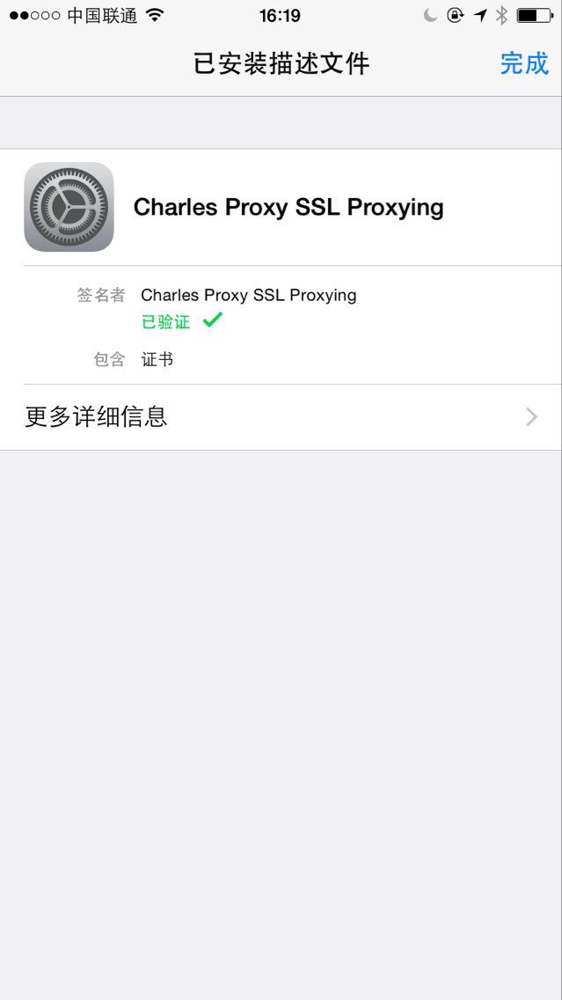

##4-1.mac上编译打包ios的debug app，并给出debug app路径
本人实践截编译打包:

debug app的路径：
打开xcode，Product->Scheme->Edit Scheme
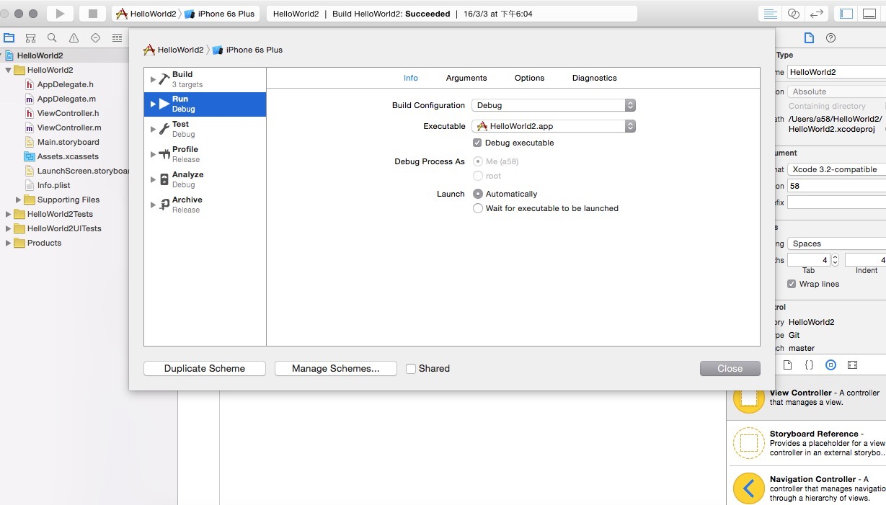
鼠标点击Executable，同步展示build好的包路径
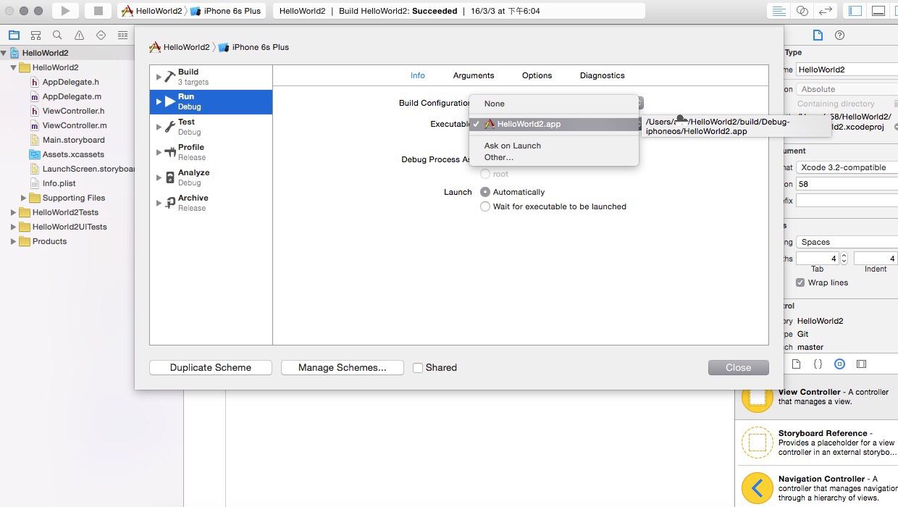

##4-2.编译打包android的debug app，并给出keystore的路径
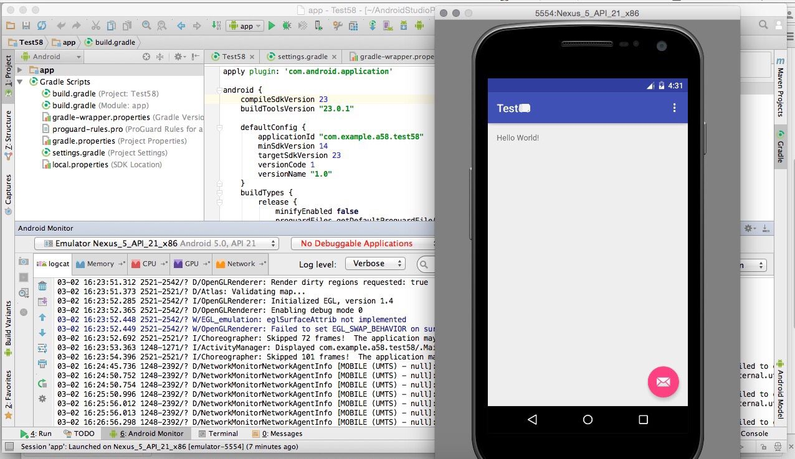
keystore路径
Eclipse-偏好设置-Android-Build-Default debug keystore
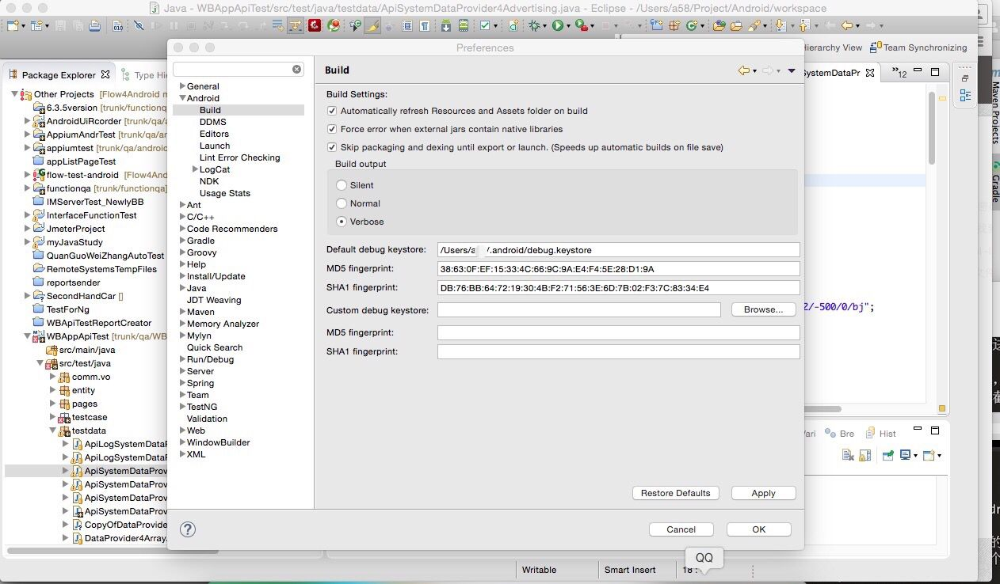

